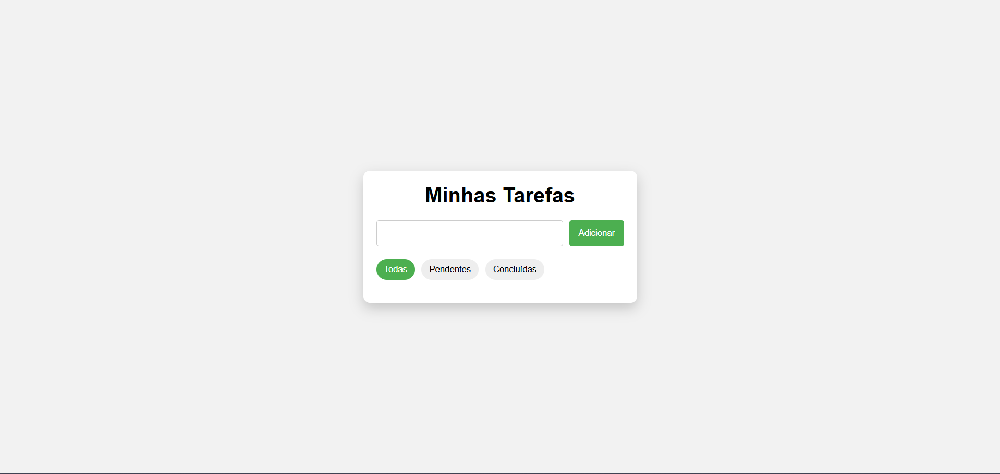

# 📝 Lista de Tarefas em JavaScript

Projeto simples de lista de tarefas desenvolvido com **HTML, CSS e JavaScript puro**, com foco em lógica, manipulação do DOM e organização de código.

## 🚀 Funcionalidades
- Adicionar tarefas
- Marcar tarefas como concluídas
- Remover tarefas
- Filtros (todas, pendentes e concluídas)
- Salvamento no LocalStorage

## 🛠 Tecnologias usadas
- HTML5
- CSS3
- JavaScript (Vanilla JS)

## 📚 O que aprendi
- Manipulação do DOM
- Uso de arrays e objetos
- Métodos `forEach` e `filter`
- Organização de código
- Persistência de dados com LocalStorage

## 📸 Preview

---

Desenvolvido por **Lucas Gabriel**